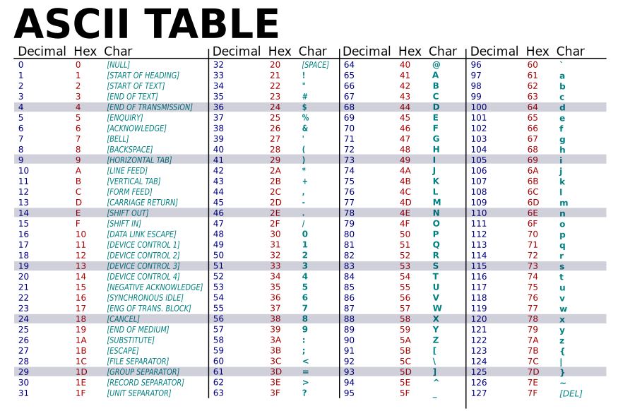

# The Bash Command Line

<br>
*Tux, the Linux penguin*

This chapter introduces the **bash command line**, an interactive terminal
native to most Linux distributions as well as MacOS. 

In the command line, you enter commands to navigate directories, manipulate files, and
run programs. You will frequently use the command line to **manage your project environment.**

>A Note on Terminology:
While there are subtle distinctions in their definitions, we can use the terms "terminal" and "command line"
interchangeably in this course. However, if we wanted to be a bit more technical here, we could refer to 
the different variants of terminal programs we use in this course (depending on the student's operating system)
as part of the <a href="https://en.wikipedia.org/wiki/Unix_shell">"Unix Shell" </a>. <br>
The "Unix Shell" is the application that provides the command line interface for "Unix-like" operating systems, 
which today are pretty much **(1) Linux** and **(2) MacOS**. The specific variant / configuration of the Unix Shell 
that we focus on in this course is **Bash**, since this variant is the default Unix shell for Linux. It was previously 
the default shell for MacOS until about *~2019*, when it was replaced by a slightly different variant, called **Zsh**. 
However, the slight difference between Bash and Zsh is negligible 
in this course, and we can -- for all intents and purposes -- treat them the same.<br>
So the next logical question becomes: Why are we so "Unix"-centric in this course?<br>
This is not due to our personal preference / our own bias, but rather due to the state of the industry: Most cloud computing 
is done on Linux servers, most of the software we use in this course installs more easily on Linux and MacOS, and the Data Science 
community in general has gravitated towards Linux as its preferred / recommended operating system. Since MacOS is in the same family
as Linux (and uses the same command-line language), this makes transitioning to Linux nearly seamless. For Windows users, not using Ubuntu 
alongside their Windows OS, unfortunately,
this is not the case -- but don't worry! Even though we won't use the Windows command line (known as **cmd.exe**, **cmd**, or the **Command Prompt**)
in this course, using a tool like <a href="https://gitforwindows.org/">Git Bash</a> allows you to run 
Bash commands inside of your Windows machine. 


## Command Line Tutorial
---

If you have no previous experience with Unix-like systems or only
know a few commands but would like to know more, this tutorial is a great start.

Note:

---
##### This tutorial works on the Linux bash, the MacOS terminal,on Windows using the Git bash, given that Python 3 is installed onyour system.
---


### Goal

In this tutorial, you will be looking for a word with 11 characters:


All characters are hidden in the exercises below.


### Preparations

All exercises can be solved using a **Unix-like terminal** (including MacOS terminal)
as well as **Git Bash** for Windows.

-  download the <a href=https://github.com/spicedacademy/bash_tutorial/archive/master.zip>Bash Tutorial</a>
-  unzip the file
-  open a terminal and navigate to an appropriate workspace / directory.
-  navigate into the *bash_tutorial* directory.
-  when you type ``ls`` it should look like this:


<!-- If you know **git** already, you can also clone the repository:

  

      git clone https://github.com/spicedacademy/bash_tutorial.git
 -->


Directories and Files
---------------------------


### Navigating Directories


The **first character** is hidden in a file somewhere in the ``exercise1/``
directory tree. Use the commands


```bash
cd <directory_name>
```

to move from one directory to the next. (do not type the pointy brackets,
just insert the directory name after the ``cd`` command.)

Once you've changed to a new directory, you can use

```bash
ls
```

list the directory's contents. Look through subdirectories
until you find one with the name ``solution_1.1`` and list its contents.
If you went to a wrong directory, you can go back one level by typing:

```bash
cd ..
```

or go back to your home folder:

```bash
cd 
```
or 

```bash
cd ~
```

### Show a Hidden File


Some files are not visible immediately. To see them, you need the
command

```bash
ls -a 
```

The **second character** is in the same directory as the first one, but
in a hidden file.

### Execute a Program

Use `cd ..` to go back to the directory ``exercise_1/directoryB/``. When
listing its contents, you should see a **shell script** file called ``program.sh``.
To find the **third character**, you need to execute the program.
In bash, this can be done with the `source` command:

```bash
source program.sh
```

<br />

Hint:

   *When typing names of directories or files,
   press ``[TAB]`` after the first few characters.
   Unix tries to guess what you are typing.*

### Find Out How Big a File is

Go to the folder ``exercise_1/directoryC/``. To find **the fourth
character**, you need to find out how big the text file in the directory
is. This is done with the command
```bash
ls -l
```
In the table the command produces, you will find the file size (in bytes)
next to the date/time when the file was last modified.

Look up the file size (decimal value) in the <a href="https://en.wikipedia.org/wiki/ASCII#Printable_characters">
Table of printable ASCII characters</a>
to obtain the corresponding character. For example, if the file size is 65 bytes,
then the fourth character would be the letter `A`.




*table of ASCII characters, Public Domain*

Warning:

   >We've noticed in the past that Windows users, get a slightly different number 
   than the Linux / Mac users, presumably due to a small difference in how the Windows OS treats line breaks.<br>So for this exercise, we'll give you the answer --until we eventually phase out this question of the tutorial and 
   replace it with something that works the same way on all computers. Please pardon the inconvenience!


Edit Text Files
-------------------------------

Please use ``cd ..`` to go back to the top directory of the tutorial
material. Then, change to the directory ``exercise_2``.

### See What's in a Text File

In the directory *exercise\_2/*, you will find a text file
*solution\_2.1.txt*. The **fifth character** is inside that file. To see
its contents, use the command

```bash
less <filename>
```
Hint:

Press ``q`` to leave the display mode.

### Edit Text Files

To get **character number six**, you will need to create a text file in
the ``exercise_2`` directory. On most Unix-like systems, you can do this
using the *nano* editor. To start using the nano editor directly, you can simply
run the ``nano`` command, or you can simultaneously create a new file:

```bash
nano <filename>
```
After typing in something in the body of the file (e.g. the letters you have
found so far), you will need to save and exit the program. You'll notice options
at the bottom of the screen referencing the keyboard shortcuts needed for
interacting the the program. (Note that the ``^`` symbol means the *control key*).

The **sixth character** is the letter following the control key for
saving, or "writing out" a file in *nano*.
<br>

Hint:
If you want to know more about a particular command, type <br>man <command>
You get shown a help page that you can leave by pressing 'q'.


Copy and Remove Files
-------------------------------

Please navigate inside the ``exercise_3`` directory.

### Create a Directory and Copy a File to it


To find **characters seven and eight**, create a directory named ``solution/``
and copy the files from the ``part1/`` and ``part2/`` directories into it.

For creating directories, use the command:

```bash
mkdir <directory name>
```
To copy the contents of the ``part1/`` and ``part2/`` directories into
``solution/``, run the commands:

```bash
cp part1/* solution/
cp part2/* solution/
```
Type ``ls -l solution/*`` to points towards the solution.

<br>

*Hint*: 
*What does the ``*`` symbol mean?*

### Removing Files

In the ``data`` directory, all files with an ``Y`` in their name need to be deleted.

To remove a file, use the command:

```bash
rm <filename>
```
There are many such files to be deleted in the *data* directory. To
remove more than one file at once, you can use ``*`` symbol as a wildcard:

e.g. ``rm ju*`` will delete all of ``junk.txt, juniper.txt`` and
``june.docx``.

To get **characters nine and ten**, look at the files that remain after
deleting those that contain a ``Y``.

<br>

*Hint*:

To remove an empty directory, you can use

```bash
rmdir <directory name>
```
The command

```bash

rm -r <directory name>
```
deletes a directory and everything in it.

<br>

Warning:

   On Unix, it is not possible to un-delete files!

   This makes removing files with the ``*`` symbol **very** dangerous,
   because you could wipe out everything
   with a single command
   (e.g. if you type the wrong directory by accident).
   Backups become an even better idea after learning this command.

Python Interpreter
------------------------

Please go to the directory ``exercise_4``.

### Running Python Scripts

To find the final character, you will need to run the python script ``file.py``.
Luckily, python runs natively in the command line (e.g. bash terminal),
so running a python script can be done simply by invoking the python interpreter
followed by the name of the script:

```bash
python3 file.py
```
The solution to the **final character** will be printed to the console.


Set Up Your Working Environment
-------------------------------
>Opening up a terminal and setting up your working directory is usually the first thing you'll do every day to get things started!<br>Here's how you can already get a head start in organizing yourself well for this week. 


### Step 1: Open a Command Line Terminal

-  on MacOS and Linux, open a standard terminal
-  on Windows, use the Git bash


### Step 2: Create a Folder for your Spiced Work

This may seem trivial, but it's important to always stay organized! Keep the files and folders in your computer 
neat and organized. If you haven't already, create a new folder that will contain your work during the bootcamp.

For example:

```bash
mkdir spiced_work
```


If you can already do this, then you're in a good place 🎉🎉! 

For the rest of the steps in setting up a good working environment, however, 
you're going to need knowledge of git.


---
<br>

### Recap Exercises and More Challenges
<br>

#### The Locked Chest 🌶️

<br>

   1. Create a new directory ``secret_chamber/``
   2. Create an empty text file ``chest`` inside it
   3. Store the word *treasure* inside the chest file
   4. Lock the chest: remove read/write permission for everybody (Hint: This does not work with *Git Bash* in Windows)
   5. Step out of the chamber to the parent directory
   6. Hide the chamber by renaming it to ``.secret_chamber/``
   7. Read the contents of the chest again

---
<br>

#### Spices 🌶️🌶️

<br>


   1. Create a new directory ``fruit/``
   2. Create 7 empty text files like ``apple``, ``banana`` etc.
   3. Store all file names in a text file
   4. List all file names that contain the letter ``a``
   5. Store the names with ``a`` in a text file
   6. Use ``diff`` to find all file names not containing an ``a``
---
<br>

Recap Questions❓❓❓
<br>


   -  What does ``cd ..`` do?
   -  What is the difference between ``cd home/`` and ``cd /home``?
   -  Explain the output of `ls -la`
   -  How can you repeat the last command you entered?
   -  When does TAB-completion work?
   -  How can you look up the documentation of bash commands?
